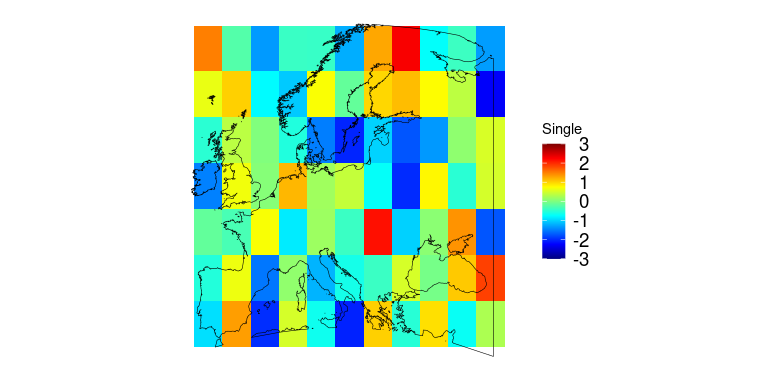
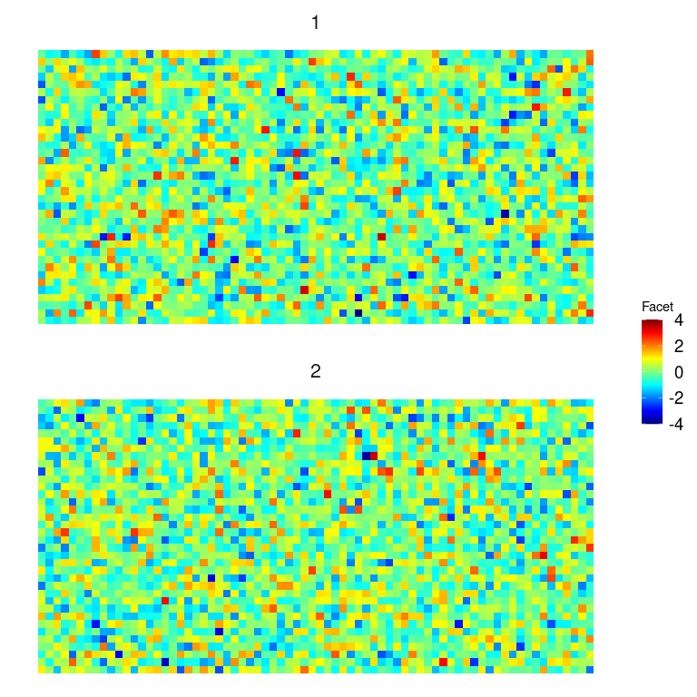
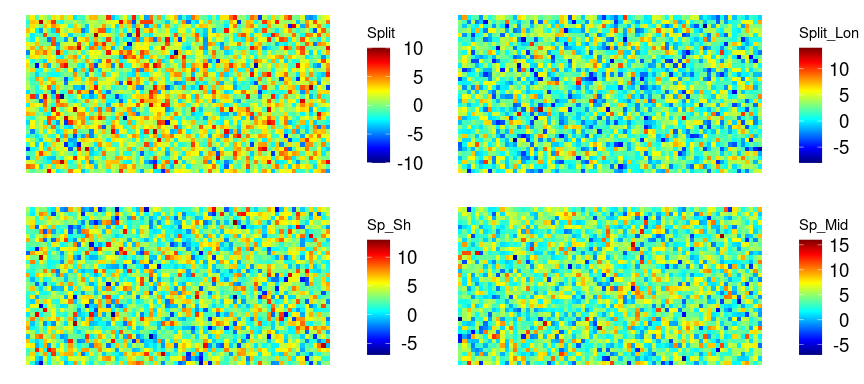
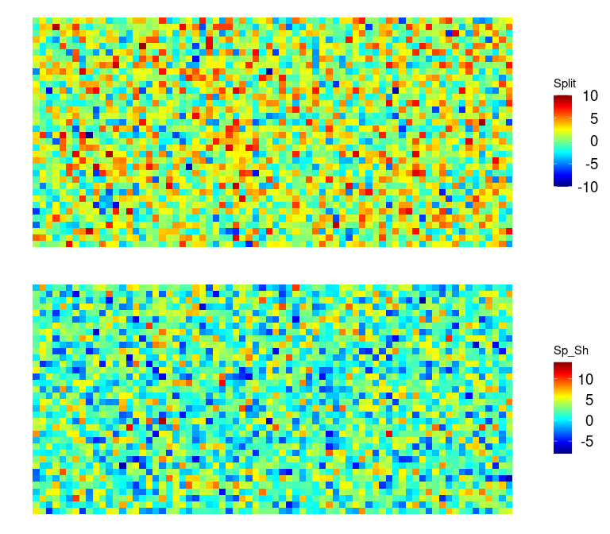
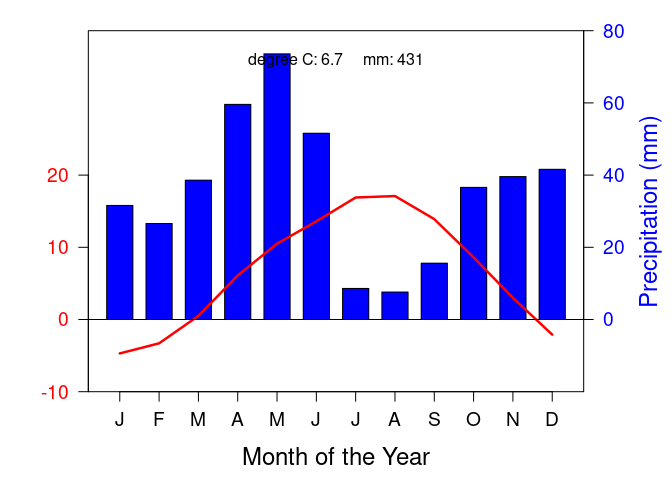
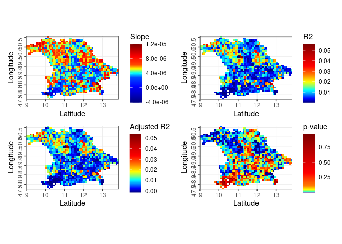

ggmap2 - R package to easily create nice maps
================

## Install ggmap2 package

To *use* the package, it can be installed directly from GitHub using the
`remotes` package.

``` r
# Install packages from Github
#install.packages("remotes")
remotes::install_github("RS-eco/ggmap2", build_vignettes = TRUE)
```

After installation, load the package

``` r
library(ggmap2)
library(sf)
```

**If you encounter a bug or if you have any problems, please file an
[issue](https://github.com/RS-eco/ggmap2/issues) on Github.**

## Data

### Outline

`outline` is a shapefile of the world’s land regions:

``` r
# Load outline
data(outline)

# Plot outline of Europe
plot(outline, xlim = c(-11, 43), ylim = c(34, 68), asp = 1)
```

<!-- -->

### Continents

``` r
# Load continents
data(continents)

# Plot map of Africa
plot(continents[1])
```

<!-- -->

### Islands

``` r
# Load large islands data
data(largeislands)

# Plot map of Mauritius
plot(sf::st_geometry(largeislands[largeislands$Island=="Mauritius",]))
```

<!-- -->

``` r
# Load small islands data
data(smallislands)

# Plot map of Maldives (islands smaller than 1 km2)
maldives <- smallislands[grep(smallislands$NAME_ENGLI, pattern="Maldives"),]
plot(sf::st_geometry(maldives))
```

<!-- -->

## Functions

The `ggmap2` package currently contains the following functions:

- `ggmap2`, a function to easily create nice maps
- `climograph`, a function to automatically produce a climograph of any
  region in the world. <!-- Add altitude -->
- `distanceToCoast`, a function to calculate the distance to
  coast/shore.
- `getData2`, this is a copy of the `getData` function from the raster
  package, but with some very helpful additional data resources
  (i.e. GEBCO, Bio-Oracle, MarSpec, WDPA, gimms3g) implemented.
- `downloadNDVI`, a function for downloading the GIMMS3g ndvi data.
- `ndvi3g`, a function to read the GIMMS3g ndvi data, which was
  downloaded manually or using the downloadNDVI function.
- `ggRegression`, a function to produce maps of the slope, R², Adjusted
  R² and p-Value of point-wise linear model based on a time-series
  raster object.

<!-- Add geom_northarrow, geom_scalebar and geom_windrose (See Lough Neagh code!!!) -->

### ggmap2

`ggmap2` is a function to create global or regional maps, either
standalone or combining multiple plots into a facet or grid. In
addition, it automatically adds the outline of the world’s land mass to
each plot, if country is specified as TRUE.

``` r
# Load raster library
library(raster)

# Create data
set.seed(54321)
r <- raster(nrow=36, ncol=72)
s1 <- stack(lapply(1:2, function(i) setValues(r, rnorm(ncell(r), 0, 1))))
s2 <- stack(lapply(1:5, function(i) setValues(r, rnorm(ncell(r), i, 3))))

# Turn raster into data.frame
#df <- as.data.frame(rasterToPoints(s2))

# Create single plot
ggmap2(s1[[1]], name="Single", split=FALSE, ncol=1, country=TRUE)
```

<!-- -->

``` r
# Also works if you use a data.frame as input
#ggmap2(df[,c(1,2,3)], name="Single", split=FALSE, ncol=1, country=TRUE)
```

``` r
ggmap2(s1[[1]], name="Single", split=FALSE, ncol=1, extent=c(-11, 43, 34, 68))
```

<!-- -->

``` r
# Same as df[,c(1,2,3,4)] as data input
```

``` r
ggmap2(s1, name="Facet", split=FALSE, ncol=1, country=FALSE)
```

<!-- -->

``` r
# Same as df[,c(1,2,3,4)] as data input
```

``` r
# Create multiplot with grid.draw
# This requires that the number of plots is dividable by the number of columns
ggmap2(s2[[1:4]], name=c("Split", "Split_Lon", "Sp_Sh", "Sp_Mid"), 
       split=TRUE, ncol=2, country=FALSE)
```

<!-- -->

``` r
# Also works using df[,c(1,2,3,4,5,6)] as data input
```

``` r
# Create multiplot with grid.arrange
ggmap2(s2, name=c("Split1", "Split2", "Split3", "Split4", "Split5"), 
       split=TRUE, ncol=2, country=FALSE)
```

<!-- -->

``` r
# Also works using df as input
```

``` r
# Create multiplot with one column
ggmap2(s2[[1:2]], name=c("Split", "Sp_Sh"), split=TRUE, ncol=1, country=FALSE)
```

<!-- -->

``` r
# Also works with df[,c(1,2,3,5)] as data input
```

### climograph

`climograph` is a function to plot the monthly temperature and
precipitation of a given location.
<!-- Add Altitude to climograph, check out R package that provides some more similar/identical functions! -->
<!-- Change into ggplot2-object -->

``` r
climograph(lon=39.5, lat=40.5, res=10, path="/home/matt/Documents/", save=FALSE)
```

<!-- -->

### getData2

``` r
getData2("WDPA", country="LIE")
```

### downloadNDVI & ndvi3g

Download global GIMMS ndvi3g data and load it into R

``` r
# Download data
#downloadNDVI(startyear=1981, endyear=1990, version="v0", path="/home/matt/Documents/GIMMS")

# Read downloaded data
gimms3g_v0_bav <- ndvi3g(extent = c(8, 14, 47, 51), version="v0", startyear=1981, endyear=2011, 
                         path="/home/matt/Documents/GIMMS")

# Mask by outline of bavaria
library(bavDC)
data(bavaria)
gimms3g_v0_bav <- raster::mask(gimms3g_v0_bav, bavaria)
```

Create animation of GIMMS ndvi3g data

``` r
# Plot data
library(sf)
for(x in 1:nlayers(gimms3g_v0_bav)){
  raster::plot(gimms3g_v0_bav[[x]], breaks=seq(0, 1, by=0.1), col=rev(terrain.colors(10)), 
               main=zoo::as.yearmon(seq(as.Date('1981-01-15'), as.Date('2011-12-15'), 'month'))[x])
  plot(sf::st_geometry(bavaria), add=T)
  Sys.sleep(0.02)
}
```

<!-- -->

### ggRegression

Perform a point-wise regression on a time-series raster stack and plot
maps of Slope, R2, Adjusted R2 and p-value.

``` r
ggRegression(data=gimms3g_v0_bav)
```

<!-- -->
